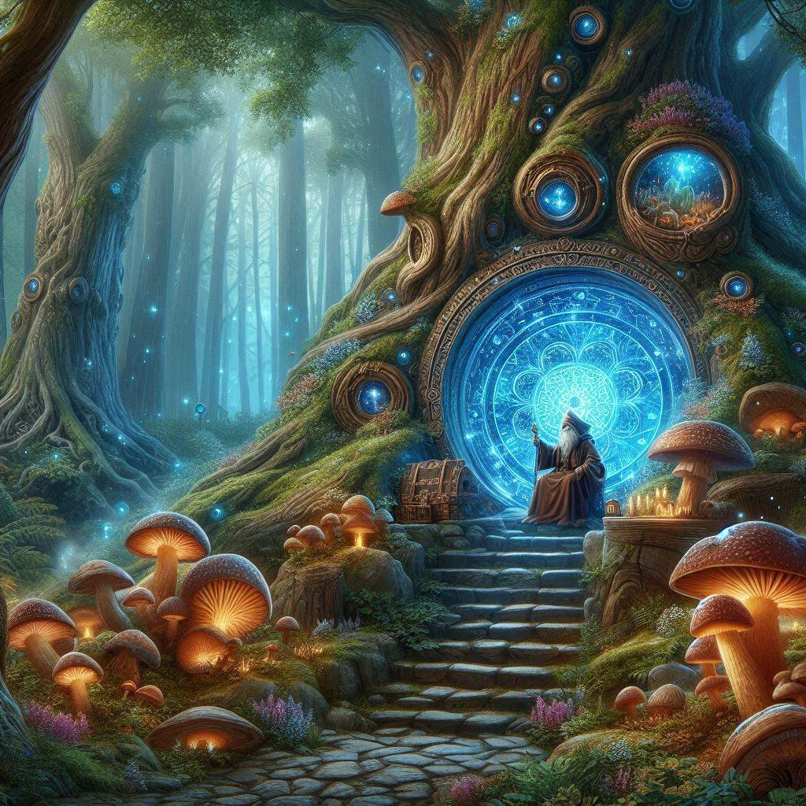

# GitHubmageLair

Welcome to GitHubmageLair, your mystical sanctuary where GitHubmages delve into the depths of coding magic and version control sorcery.

## About

GitHubmageLair is a repository dedicated to exploring the intersection of coding, creativity, and collaboration. Whether you're a seasoned GitHubmage or a novice coder, this repository offers a treasure trove of resources, tools, and utilities to enhance your coding journey.

## Repository Structure

- **Wizard'sWorkbench**: Holds miscellaneous files, tools, or utilities used by GitHubmages in their coding endeavors.
- **PotionPantry**: Contains configuration files or settings related to project dependencies, symbolizing the GitHubmage's potion-making prowess in managing libraries and dependencies.
- **CrystalBall**: Stores predictive analytics or machine learning models, representing GitHubmages' attempts to foresee and mitigate future coding challenges.
- **Dragon's Den**: Houses scripts or files related to enchantments or magical enhancements applied to the codebase, such as build scripts or automation tools.
- **ArtifactArchive**: Stores artifacts or magical relics related to the project, such as images, diagrams, or documentation. This includes the crucial secret file svc-githubmagelair.json for sending the mage to his secret lair in the cloud.
- **EnchantmentChamber**: Contains scripts or files related to enchantments or magical enhancements applied to the codebase, such as build scripts or automation tools.
- **src**: Golang source code to create a command-line binary with three riddles to unlock hidden knowledge.

## Get Started

To embark on your coding adventure in GitHubmageLair, clone this repository to your local machine and explore the mystical artifacts within. May your code be enchanted and your commits be legendary!

## Credits

GitHubmageLair is brought to you by a community of GitHubmages dedicated to pushing the boundaries of coding creativity. Join us on this magical journey as we unlock the secrets of the digital realm together.

---

Unleash your coding magic and explore the wonders of GitHubmageLair! Are you ready to embark on this enchanting journey?

